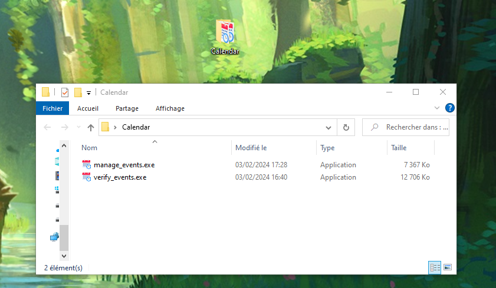
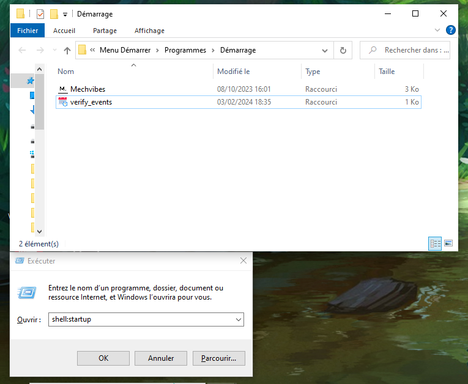
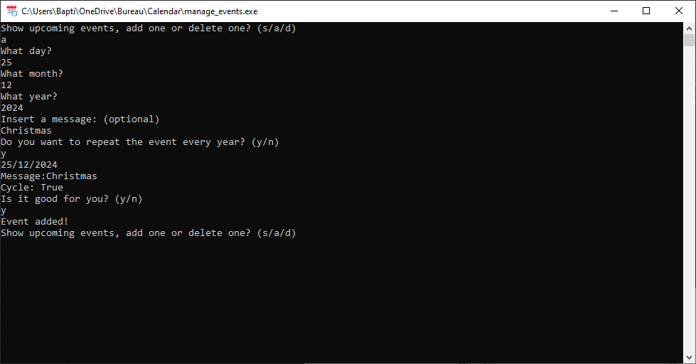

# Calendar

    

This **calendar** made entirely with Python is a program where you can store and manage events. When an event is approaching, a Windows notification will be launched to alert you.

## Download

- 🟢 **[Latest release](https://github.com/Pietot/Calendar/releases/latest)**

## Feature

- Verify events at every startup of your computer

- Custom label for an event

- Verify if a date is correct

- Throw Windows notification week before, 1 day before and on the day of an event

- Support leap years

- Support repeated events

- Auto and manual deletion

## Setup

Once you have downloaded the two executables, follow these steps:

- Move both .exe in a same directory

    

- Create a shortcut for verify_events.exe

- Move the shortcut to the Windows startup folder
  (**Windows + R** then **shell:starup** or C:/Users/{name}/AppData/Roaming/Microsoft/Windows/Start Menu/Programs/Startup)

    

That's all!

> **Note**: You can also create a shortcut for manage_events.exe for the desktop and then move the directory of both executables somewhere else

## How to use ?

Start bien running manage_event.exe, three options are available to you:

- Show events, with the input "s"

- Add an event, with the input "a"

- Delete an event, with the input "d"

> **Note**: If you don't type anything and press "Enter", the program will exit, if you type something else like "n" or "0", the program will ask you the question again.

- If you type "s", the program will you show your events like this:

**{"date": "2024-12-25", "label": "Christmas", "cycle": true}**

- If you type "a", just follow the instruction to add an event like this:

    

> **Note**: If you don't want to insert a message, just press Enter. For y/n questions, you can type anything for yes, but n and nothing (blank answer) for no

- If you type "d", insert the index of the event you want to delete
